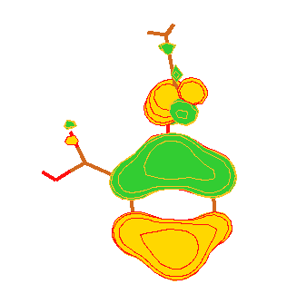
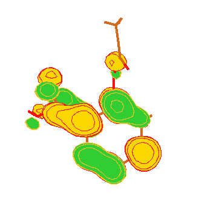

Applications
------------

This is by no means any exhaustive list of Computational Quantum Chemistry
applications, but only a brief introduction to some characteristic
calculations that are commonly performed.

### Electronic Structure

Obviously, the first application that comes to mind is the fine resolution of
molecular structure. To achieve this, we try to adjust the geometry until we
obtain the lowest energy level. This is, in itself, interesting enough, but
has a problem: for the most important biological molecules (macromolecules) we
need to carry out very large computations that are unfeasible using
traditional methods. We need to resort to modern, linear scaling methods to
deal with these structures.

In any case, the calculations we can easily perform, are very useful: on one
hand we can analyze in great detail substrates, drugs and smaller molecules,
and on the other hand, even if modeling a full macromolecule is hard, we can
model a relevant part of it, such as a protein's active site.

When we resolve the electronic structure, we not only find the best geometry,
but also the electronic charge distribution, which allows us to determine
dipole, quadrupole, etc.. moments, and specially, the charge distribution in
specific molecular orbitals. This is more interesting as it allows us to
identify the reactive areas of molecules: the **HOMO** (Highest Occupied
Molecular Orbital) is the outermost occupied orbital, the one that contains
reactive electrons in electron donor molecules, while the **LUMO** (Lowest
Unoccupied Molecular Orbital) identifies the first orbital with free space to
accommodate an electron in electronic acceptor molecules.

There are visualization programs that can show not only the optimized
geometry, but also the HOMO and LUMO distributions, enabling us to predict the
reactive regions in a molecule.

|HOMO|LUMO|
|----|----|
|||
||

Let's take aspirin as an example: visit Wikipedia page on aspirin and read the
section devoted to its synthesis and decomposition under high concentrations.
Can you spot any correlation between the reactive region and either the HOMO
or LUMO?

### Population analysis

This is a method to analyze the spatial distribution of electronic density,
partitioning it among the different component nuclei of the molecule (which
would be equivalent to calculating the partial charge in each atom), in
between them (the bonds, which would be like measuring bond order), etc... It
is worth recalling here that a molecule is nothng but a set of nuclei
surrounded by a shared electronic cloud, notwithstanding which, this
"partitioning" is very useful to provide an intuitive understanding of the
system.

The most popular system is **Mulliken's population analysis**. It is the
simpler, although not the more precise. Other methods have been developed to
overcom Mulliken't method shortcomings, such as **Lowdin's population
analysis** and **Natural Bond-Order (NBO)** analysis.

An additional -controversial, yet intuitive- alternative is the method of
**Atoms in Molecules (AIM)**, which tries to divide electronic density around
nuclei as if the molecule was composed of atoms.

### Charge distribution

Another calculation that is often useful consits in finding dipole,
quadrupole... and in general multipole moments of molecules. This is employed
to simplify calculations of intermolecular interactions, to define descriptors
for QSAR models, or to compute electrostatic charges in a molecule, defined as
the charge distribution on its surface (usually defined as its Van der Waals
radius), also known as **Electrostatic Surface Potential (ESP)**. The most
popular method to compute charge distributions is likely **ChelpG**.

### Molecular dimensions

The overall size and shape of the molecule are important parameters, not only
to describe a molecule, but also because they enable us to build simplified
QSAR models of a molecule or family of related molecules that, together with
multipoles and other properties enable us to simplify and speed up database
searches for novel active compounds.

### Energy and tensions

We can calculate the energy for different states of a system. This is useful
as their difference will allow us to compute changes in free energy associated
with transitions from one state to the next. We can use this feature to
compute reaction energies simply calculating the difference between the
initial and final states. If, in addition we also identify the saddle point
corresponding to the transition state, we can calculate the required
activation energies as well.

Besides the structure and energy of a system, we can also compute the forces
acting on each nucleus, as well as vibrational frequencies. These values
enable us to embed quantum calculations in the framework of molecular dynamics
simulations, hence gathering a dynamical view of the system: we can, for
instance partition the system in two regions, the larger being modeled by
Molecular Dynamics, and the smaller but more interesting (e. g. the active
site) by Quantum Mechanics. In these mixed QM/MM simulations, the forces in
the classical region are approximately calculated using traditional MD force
fields, while in the QM region we will use the forces and charge distributions
explicitly computed by QM methods.

### Saddle point calculations

One of the most interesting calculations we can carry out consists on **saddle
point calculations**. The basic idea is simple: given a chemical reaction
where we know the reactants and products, we can calculate the properties of
each state separately as we have already seen. Their difference will give us
important information like the free energy of the reaction.

But we can go further: we assume that the energy landscape between both
configurations has the shape of a saddle, that is, there is a lowest energy
path between both states surrounded by higher energy slopes on both sides. We
can study this path to get an image of how the chemical reaction actually
takes place: how does energy change across the reaction, the activation energy
required to overcome the initial barrier, and specially the intermediate
conformations, of which the highest energy intermediate would correspond to
the **transition state** between reactants and products. The transition state
is that which is equally likely to evolve in either direction of the reaction,
i. e. where the derivatives (the slope) of the energy landscape become zero.
Its relevance is highlighted when we consider that many drug analogs have
structures similar to the transition state.

With this kind of calculations we can get a deeper understanding of how do
chemical reactions actually take place.and most importantly of how enzyme
carry out their functions. Basically, the method we follow looks like this:

-   We start by studying the reaction, the reaction path and the transition
    state from the reactants and products only
-   Next we try to model the presence of the enzyme
-   Then we compare both

The relevant part is modeling the presence of the enzyme. To do this we start
by locating the substrate binding site (the active site) using molecular
docking tools. Once the active site has been located, we identify the amino
acids that are closer to the substrate and add them successively to the model
simulation until we get a reaction landscape that mimics closely the
experimental knowledge.

At this point we can be confident we have indentified all relevant amino acids
involved in the reaction, a valuable information that can guide subsequent
experimental mutagenesis experiiments, for instance, helping develop more (or
less) efficient enzymes. We do also get a clear view of all important elements
in the reaction, which we can use to design better analogs or inhibitors of
the substrate, the energy change curve, transition compounds, etc...

The reason for using a proggressive approach is that normally we do not know
*a priori* which are the most relevant amino acids, but we do not want either
to include all possiblle amino acids in the simulation for two reasons: that
would greatly increase Quantum calculations, and would not allow us to
identify the most relevant amino acids for the reaction. That is why we start
with just a few and proceed adding and eliminating amino acids by trial an
error until a suitable model is found.

### QM/MM y QM/MD

It is good to remember that QM calculations are usually very expensive
computationally speaking, and so it will often not be desirable (or
reasonable) to model the whole macromolecular system using only QM. The
solution most often sought consists in partitioning the system, and relegating
QM only to the smaller chemically active region and modeling the rest of the
system with classical Molecular Dynamics. But in so doing we face a new
problem: we are no longer free to move around atoms in the QM region at our
convenience since they are connected to the rest of the protein.

We are thus commonly confronted with deciding among two approaches to deal
with this problem:

-   keep all amino acids considered in the QM region fixed in their position
    and ignoring the rest of the protein (this is the fastest approach, but
    fails to account for protein flexibility which is often relevant).

-   Simulate the active site using QM, and model the rest of the protein using
    MD or MM (Molecular Dynamics or Molecular Mechanics), tying both
    simulations to each other and transmitting influences at each cycle (this
    is slower and more complex, but allows evaluation of the contribution of
    the protein flexibility to the reaction).

In many cases we can assume the protein to be relatively rigid, hence
justifying use of the first, fastest, approach to model chemical reactions.
When protein flexibility may play a major role, we are forced to recourse to
QM/MM models.

### Other possibilities

We can find many other properties from Quantum Mechanical studies (like
electoaffinity, volume, additive properties, etc...). In general, as we get
deeper in our knowledge we will be learning more about them, or, if we need to
calculate a specific one, we can always search the documentation to learn how
it can be done..
